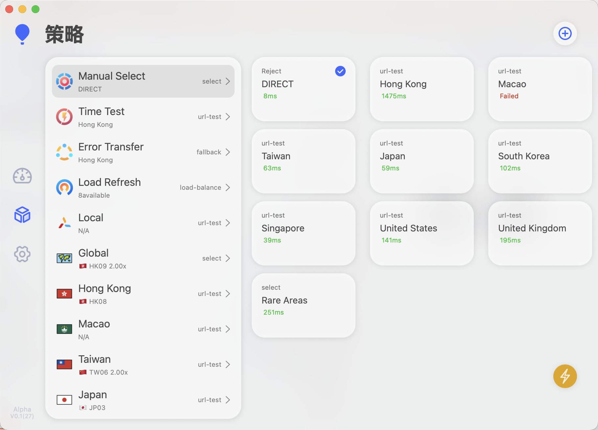
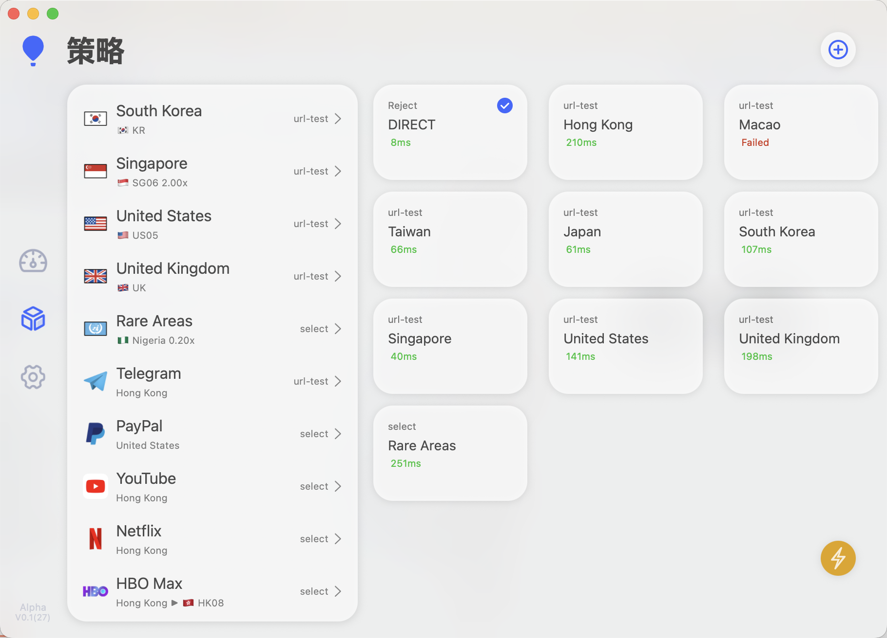
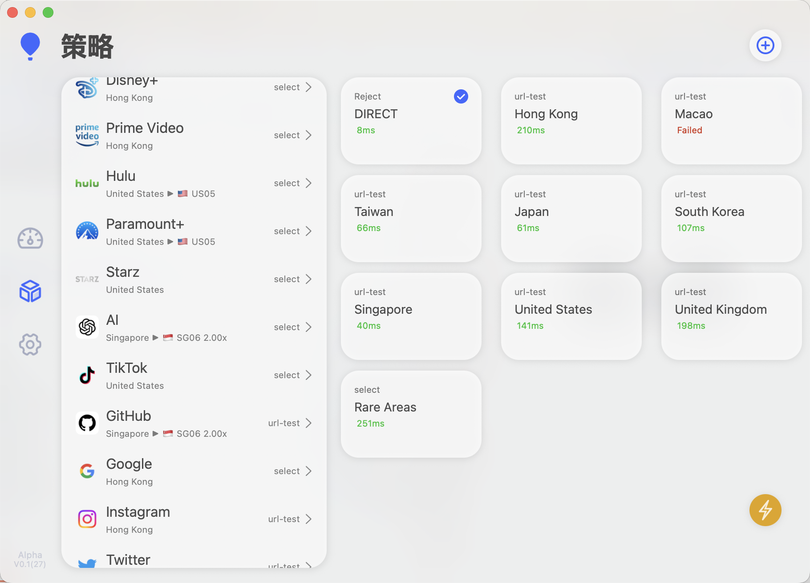
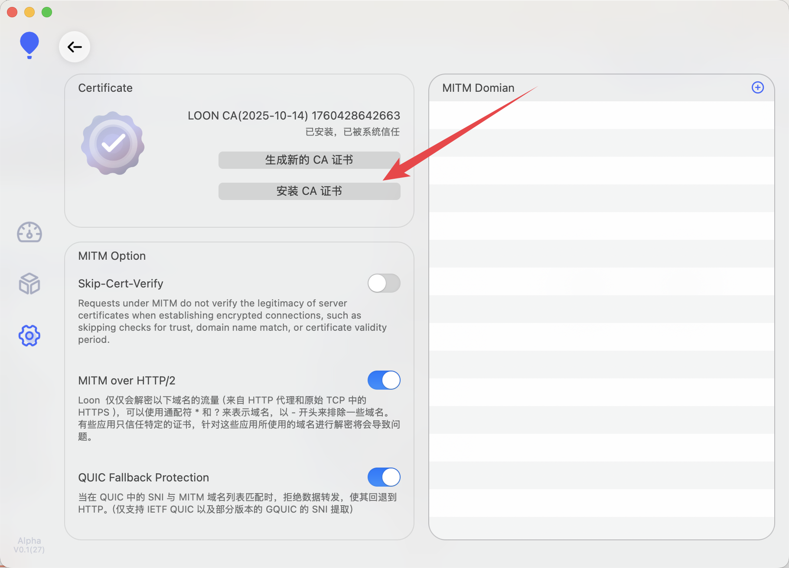

# 🛰️ Loon4Streaming — Enjoy the Streaming Life
> Language: **English** | [中文说明](./README_ZH.md)

> **Who this is for:** users who want a smoother, more controllable streaming experience on **Loon** for iOS / macOS.  
> This README is for the `Loon4Streaming.conf` in this repo. It provides a quick start, notes on policy groups, and troubleshooting.

---

## 🖼️ Screenshots (macOS)
> Examples of policy groups and routing on macOS.






## 🖼️ Screenshots (iOS)
> Examples of policy groups and routing on iOS.

Omitted for brevity; basically the same as macOS.

---

## 📦 Files

> Repo structure (example)
```
/
├─ Loon4Streaming.conf
├─ README.md
├─ README_ZH.md
└─ images/
   ├─ Mac-1.png
   ├─ Mac-2.png
   ├─ Mac-3.png
   └─ Mitm.png
```

- **Main config**: `Loon4Streaming.conf` (tidied and ready to import)

> Tip: If you also use other managed/auto-updating profiles, avoid enabling duplicate “streaming rules/policies” to prevent conflicts or overrides.

---

## 🚀 Quick Start
1. **Install Loon**: iOS (TestFlight / App Store) or macOS (requires activation code).  
2. **Import the profile**:  
   - “Profiles” → “Import from File” → choose `Loon4Streaming.conf`;  
   - Import from URL (click to copy):

     ```
     https://raw.githubusercontent.com/Sifortonzh/Loon4Streaming/refs/heads/main/Loon4Streaming.conf
     ```
3. **Add nodes**: in “Nodes”, add nodes from **your provider** 🛫, ~~and add them to the corresponding policy group~~.  
4. **Check policy groups**: open “Policy Groups” and sort by your preference (e.g., priority among US / HK / SG).  
5. **Enable MitM**: open Settings → MitM (see screenshot below), install the certificate and **trust** it. Or when importing by URL, simply **keep nodes & certificate**.



1. **One-tap speed test & logs**: run latency/throughput tests in Loon; open “Logs” to verify streaming domains are matched to the intended policy.  
2. **Start streaming**: Netflix / Disney+ / YouTube / Max / Prime Video / Hulu / Paramount+ / Starz / ~~Spotify / Apple TV+~~.

---

## 🧠 Routing & Policy Design
This profile focuses on **recognizing popular streaming domains → mapping them to appropriate regional nodes → ensuring speed and stability**.

- **Streaming master policy group**: aggregates domains for Netflix, Disney+, YouTube, Max (HBO Max), Prime Video, ~~Apple TV+, Spotify~~ and dispatches traffic to regional policies (US / HK / SG, etc.).  
- **Regional policy groups**: include at least **US / HK / SG** to switch/backstop platform availability. **Your order in Loon defines the priority** and can be adjusted anytime.  
- **Service preferences (optional):**  
  - **Google** prefers **HK** (YouTube / YouTube Music are also usually covered by the streaming policy).  
  - **Apple / Microsoft** go via **US** (helps with store/subscription/DRM consistency).  
  - **PayPal** fixed to **US** (consistent billing/risk checks).  
  - **Rare Areas**: collect uncommon/test nodes to avoid “rule pollution” in the main flow.  
- **Resilience & fallback**: if the matched node fails or underperforms, the group automatically falls back to the next candidate (behavior depends on your group mode such as priority / failover / load-balancing).

> Real availability and “unlock” scope depend on platform risk controls and node quality. Prepare multiple regions for easy switching.

---

## 🧩 Customize & Extend
- **Add a new platform**: append its domains/keywords in the rules and point them to the “Streaming” policy group.  
- **Regional preference**: just adjust the order/weights inside policy groups—no need to touch the rule details.  
- **Allow/Deny lists**: whitelist direct-connect for local CDNs or ISP-free traffic; blacklist third‑party resolvers/accelerators that might cause misrouting.

---

## 🧪 Verification
- **Log hits**: Loon → “Logs” and confirm that streaming domains hit the “Streaming” policy.  
- **Platform self-checks**: e.g., open `https://fast.com` (speed test) on Netflix or play a Netflix Original to check region; verify YouTube 4K/AV1; test Apple TV+ previews.  
- **IP/region sanity**: check account/settings pages to ensure region/billing country matches your expectation (platform display is authoritative).

---

## 🛠️ FAQ
**Q1: Playback stutter / unstable speed?**  
A: Switch to a better node in the same region; prefer routes with lower loss and shorter distance; avoid stacking with system-level VPN/proxies.

**Q2: Netflix/Disney+ unavailable or catalog shrank?**  
A: Try a region with looser platform risk control (e.g., different HK/SG/US nodes). Clear app cache & cookies and retry.

**Q3: Sign-in/payment anomalies (e.g., PayPal verification)?**  
A: Ensure the service goes through the designated region (e.g., US); keep billing/account region consistent; avoid frequent cross‑region logins.

**Q4: Conflicts with other “managed profiles”?**  
A: Don’t enable duplicate “streaming rules/policies” in multiple profiles; keep `Loon4Streaming.conf` higher priority.

**Q5: Update rules without touching my nodes/icons?**  
A: Separate “rules” from “nodes/icons”: keep rules managed, leave nodes & icons local. When updating, replace the rules section only.

---

## 🔐 Compliance & Disclaimer
- For learning and network optimization reference only. Follow local laws/regulations and each platform’s Terms of Service.  
- Cross‑region access/subscriptions involve risks borne by the user.

---

## 🗓️ Version
- Doc updated: 2025‑10‑14 (Asia/Singapore, UTC+8)  
- Target: `Loon4Streaming.conf`

> Suggestions are welcome—open an issue/PR or fork and customize.

## 🛫 Personal Providers

- [Flower: very well‑known—often the first choice for streamers. ~~Because TAG is too pricey, jk~~](https://api-flowercloud.com/aff.php?aff=13383)  
- [YToo: a sub‑brand of Flower; same features, slightly lower cost. Comes with an Emby I personally don’t find very useful.](https://y-too.com/aff.php?aff=7148)  
- [守候网络 (SNTP): a cost‑effective, higher‑end dedicated‑line provider (includes a high‑quality Emby server).](https://d.xn--hwqp2zit2amna.net/auth/register?code=BcADJolY)
