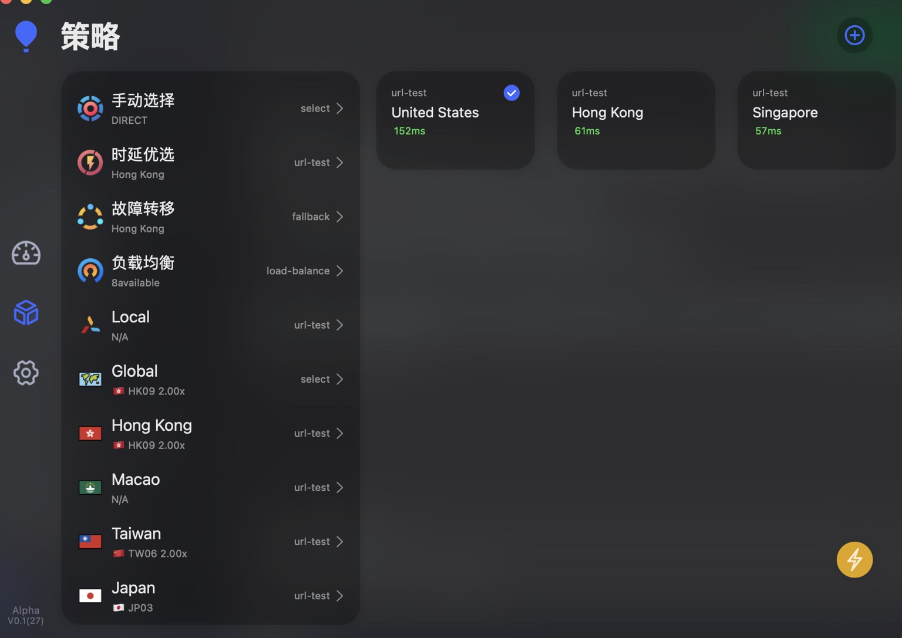
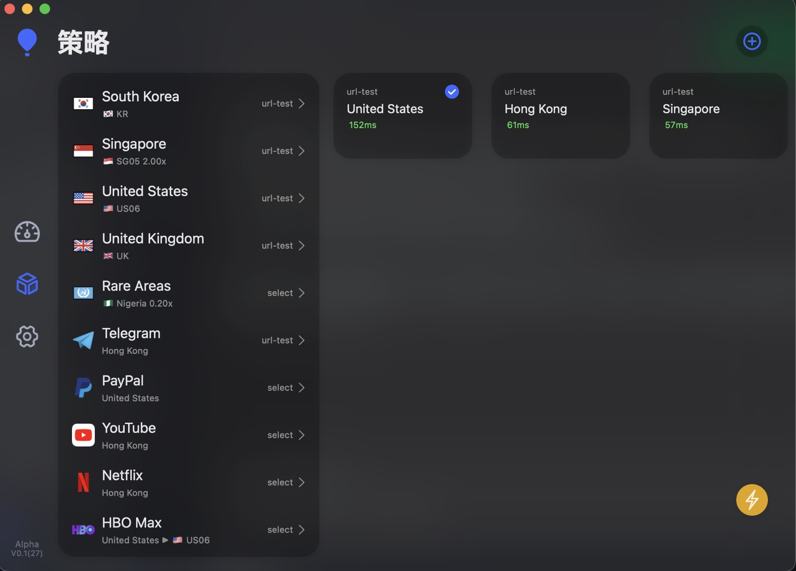
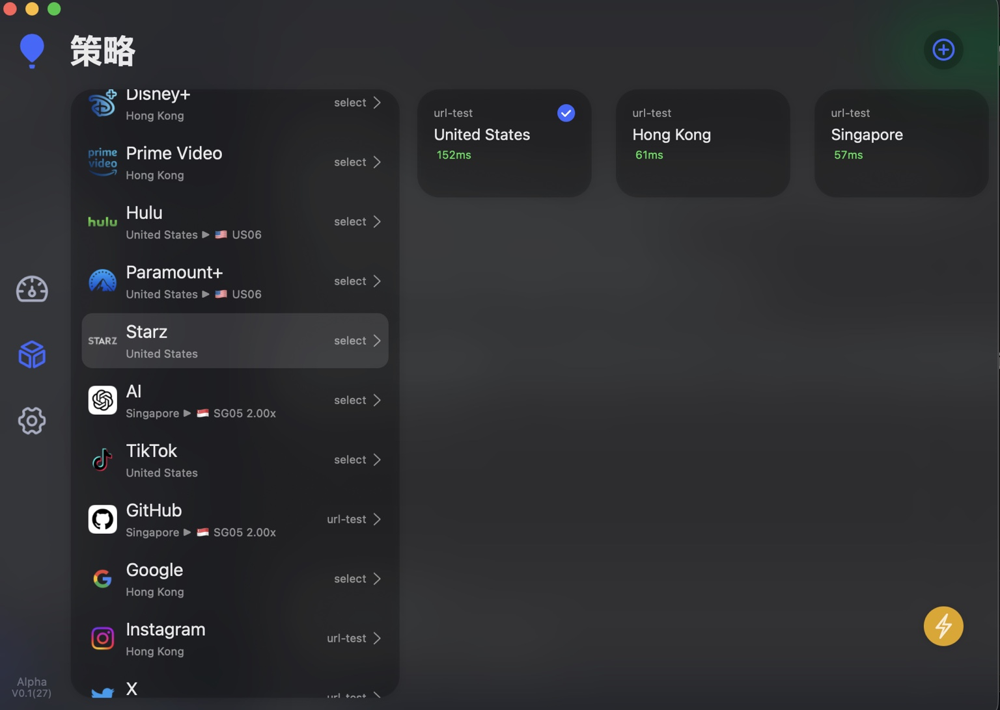
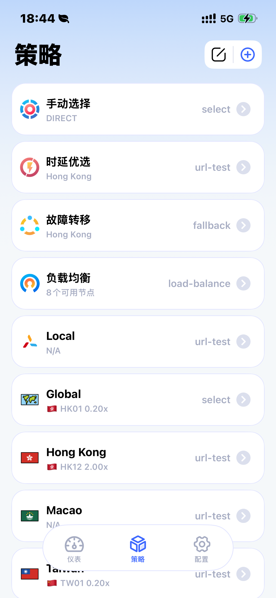
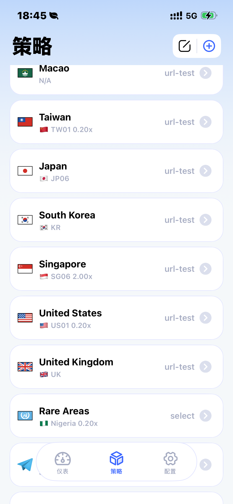
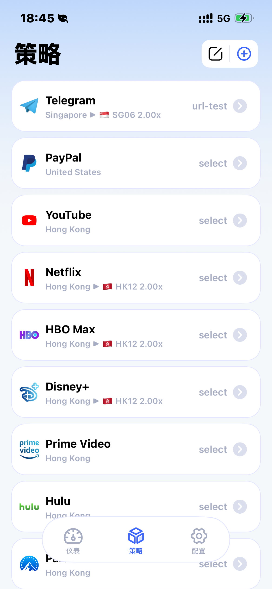
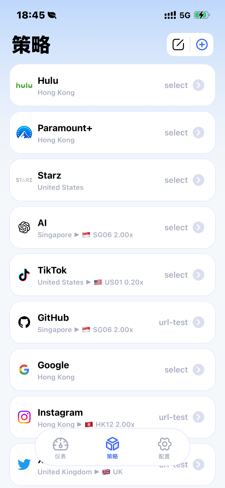

# 🛰️ Loon4Streaming.conf — 流媒体优化配置 README

> 适用对象：希望在 iOS / macOS 上通过 **Loon** 获得更顺滑、更可控的流媒体体验的用户。  
> 本 README 针对仓库中的 `Loon4Streaming.conf` 文件编写，提供快速上手、策略组说明与常见问题排查。

---

## 🖼️ 展示图（macOS）
> 以下为 macOS 版策略组与分流效果示例。






## 🖼️ 展示图（iOS）
> 以下为 iOS 版策略组与分流效果示例。






---

## 📦 文件

> 仓库结构（示例）
```
/
├─ Loon4Streaming.conf
├─ README_ZH.md
├─ README_EN.md
└─ images/
   ├─ mac-1.jpg
   ├─ mac-2.jpg
   ├─ mac-3.jpg
   ├─ ios-1.png
   ├─ ios-2.png
   ├─ ios-3.png
   └─ ios-4.png
```

- **主配置**：`Loon4Streaming.conf`（已整理完毕，导入后即可使用）

> 提示：如你同时使用其他托管/自动更新配置，请避免重复启用同类“流媒体分流/策略组”，以免冲突或被覆盖。

---

## 🚀 快速上手
1. **安装 Loon**：iOS（TestFlight/正式版）或 macOS（App Store/官网版）。  
2. **导入配置**：
   - 「配置」→「从文件导入」选择 `Loon4Streaming.conf`；或
   - 使用远程链接（若你将本文件托管到 Git/网盘）。
3. **添加节点**：在「节点」中添加你的 US / HK / SG 等地区节点，并加入对应策略组。
4. **检查策略组**：进入「策略组」，按你的偏好排序（例如 US/HK/SG 的优先级）。
5. **一键测速 & 日志观察**：在 Loon 内测试延迟/速率；打开「日志」观察流媒体域名是否命中正确策略。
6. **开始播放**：打开 Netflix / Disney+ / YouTube / Max / Spotify / Apple TV+ 等进行实际体验。

---

## 🧠 分流与策略组设计
本配置关注“**识别常见流媒体域名 → 匹配合适地区节点 → 保障速度与稳定**”。

- **流媒体总控策略组**：聚合 Netflix、Disney+、YouTube、Max（HBO Max）、Prime Video、Apple TV+、Spotify 等平台域名；自动匹配到区域策略（US / HK / SG 等）。
- **区域策略组**：至少包含 **US / HK / SG**，用于切换/兜底不同平台的可用区。优先级 **以你在 Loon 中的排序为准**，可随时拖拽调整。
- **平台/服务偏好（可选）**：
  - **Google** 优先 **HK**（YouTube、YouTube Music 等域名通常也由流媒体策略接管）。
  - **Apple / Microsoft** 走 **US**（有助于部分商店/订阅/DRM 服务的一致性）。
  - **PayPal** 固定 **US**（便于账单/风控的一致性）。
  - **Rare Areas / 冷门地区**：将少见或测试性节点统一收纳，避免“规则污染”主工作流。
- **容错与回退**：若命中策略节点失效/表现不佳，组内将自动回退到下一个可用节点（具体行为取决于你设置的策略组类型，如“优先级/故障转移/负载均衡”）。

> 实际可用性与解锁范围依赖平台风控与节点质量，建议准备多个地区以便切换。

---

## 🧩 自定义与扩展
- **新增平台**：在规则区新增相应域名/关键字并指向“流媒体策略组”。
- **地区偏好**：只需在策略组中调整地区节点的排序或权重，不必修改具体规则。
- **黑/白名单**：对个别平台（如本地 CDN、运营商免流）可建立白名单直连；对易致冲突的第三方解析/加速服务可加入黑名单避免误路由。

---

## 🧪 验证方法
- **日志命中**：Loon →「日志」观察流媒体域名是否命中“流媒体策略组”。
- **平台自检**：例如 Netflix 打开 `https://fast.com`（测速）或播放自制片检查地区；YouTube 查看 4K/AV1 可用性；Apple TV+ 试播展示。  
- **IP/区域核验**：平台设置页或“我的账户”中检查地区/账单区是否被识别为预期区域（以平台显示为准）。

---

## 🛠️ 常见问题（FAQ）
**Q1：播放卡顿/不稳定？**  
A：更换相同地区的更优节点；优先选择距离近、丢包低的线路；避免与系统级 VPN/代理叠加。

**Q2：Netflix/Disney+ 显示不可用或库变少？**  
A：切换至平台风控较宽松的地区（如 HK/SG/US 不同节点），清理 App 缓存与 Cookies 后再试。

**Q3：平台登录/支付异常（如 PayPal 触发验证）？**  
A：确保相关服务走指定地区（如 US），保持账单区/账号区一致；避免频繁跨区登录。

**Q4：与其他“托管配置”冲突？**  
A：请避免在多个配置中同时启用“流媒体分流/策略组”；确保 `Loon4Streaming.conf` 的优先级较高。

**Q5：如何只更新规则而不改动我的节点/图标？**  
A：建议将“规则”与“节点/图标”分离管理：规则文件走托管；节点与图标留在本地。更新时仅替换规则段。

---

## 🔐 合规与声明
- 本配置仅供学习与网络优化参考，请遵守你所在地法律法规及各平台服务条款。  
- 跨区访问与订阅风险由使用者自行承担。

---

## 🗓️ 版本信息
- 文档更新：2025-10-13（Asia/Singapore, UTC+8）
- 适配：`Loon4Streaming.conf`

> 有任何改进建议，欢迎在提交处反馈或自行派生（Fork）定制。
